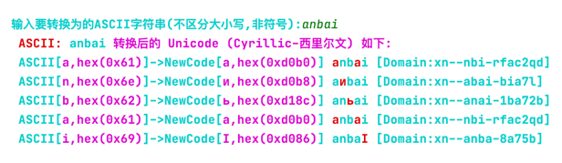
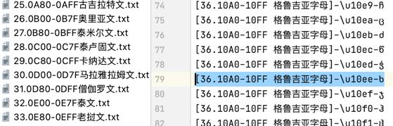

## Punycode 字符生成 与 字符替换

### Punycode 是什么
    
Punycode（译为：域名代码）是一种表示Unicode码和ASCII码的有限的字符集。例如：“münchen”（德国慕尼黑）会被编码为“mnchen-3ya”。

### 国际化域名

早期的DNS（Domain Name System）是只支持英文域名解析。在IDNs（国际化域名Internationalized Domain Names）推出以后，为了保证兼容以前的DNS，所以，对IDNs进行punycode转码，转码后的punycode就由26个字母+10个数字，还有“-”组成。

### 浏览器支持
因为操作系统的核心都是英文组成，DNS服务器的解析也是由英文代码交换，所以DNS服务器上并不支持直接的中文域名解析，所有中文域名的解析都需要转成punycode码，然后由DNS解析punycode码。
实际上各种浏览器都完美支持中文域名，只是浏览器软件里面主动加入了中文域名自动转码，不需要原来的再次安装中文域名转码控件来完成整个流程。

### 转码例子
> 例如：企鹅.com，用Punycode转换后为：xn--hoq754q.com

> 中国.cn，用Punycode转换后为：xn--fiqs8s.cn

### 生成、替换效果

> python2.7 main.py

> python2.7 produce.py

### 参考链接

    Unicode 字符百科 https://unicode-table.com/cn/blocks/
    IDN homograph attack https://en.wikipedia.org/wiki/IDN_homograph_attack
    Punycode 钓鱼 https://mp.weixin.qq.com/s/yaN1WkAPRaYlLuekvo8zHg
    Punycode 钓鱼 https://www.freebuf.com/articles/network/255592.html
    
    https://github.com/k-vulner/punycode_fuzzing
    https://www.wordfence.com/blog/2017/04/chrome-firefox-unicode-phishing/
    https://www.xudongz.com/blog/2017/idn-phishing/
    https://www.honoki.net/2017/04/punicoder-discover-domains-that-are-phishing-you/
